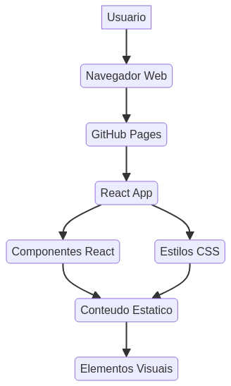

# Professional-Landing-Pages

*Placeholder: Imagem hero de alta qualidade representando a landing page profissional.*

## English

### 🚀 Overview

This repository showcases a collection of **professional landing page templates** designed with a focus on conversion optimization, modern aesthetics, and robust development practices. It serves as a comprehensive demonstration of advanced CSS and React development skills, adhering to clean code architecture and industry-standard implementations.

### 🌟 Features

-   **Modern & Responsive Design:** Crafted with **React** and **Tailwind CSS** for a seamless experience across all devices.
-   **Conversion Optimization:** Designed with UI/UX best practices to maximize user engagement and conversion rates.
-   **Clean Code Architecture:** Emphasizes maintainability, scalability, and readability.
-   **Performance Optimized:** Ensures fast loading times and smooth interactions.
-   **Well-Documented Codebase:** Clear and concise documentation for easy understanding and future enhancements.
-   **Industry-Standard Patterns:** Implements widely accepted development patterns and practices.
-   **Interactive Elements:** Includes dynamic components to enhance user experience.

### 🛠️ Technology Stack

| Category         | Technologies Used                               |
| :--------------- | :---------------------------------------------- |
| **Frontend**     | React, Tailwind CSS, HTML5, CSS3, JavaScript    |
| **Build Tool**   | Vite                                            |
| **Styling**      | Tailwind CSS, Custom CSS                        |
| **Version Control** | Git, GitHub                                     |

### 📊 Project Structure

*Diagrama de arquitetura do projeto.*

Professional-Landing-Pages/
├── README.md
├── .gitignore
├── assets/                     # Imagens e outros recursos estáticos
│   ├── architecture_diagram.png
│   └── hero_image_placeholder.png
├── config/                     # Arquivos de configuração
│   └── LICENSE
├── docs/                       # Documentação adicional e diagramas
│   └── architecture_diagram.mmd
├── src/                        # Código fonte da aplicação
│   └── landing-page-app/       # Aplicação React da landing page
│       ├── public/
│       ├── src/
│       │   ├── assets/
│       │   ├── components/
│       │   ├── hooks/
│       │   ├── lib/
│       │   ├── App.css
│       │   ├── App.jsx
│       │   ├── index.css
│       │   └── main.jsx
│       ├── components.json
│       ├── eslint.config.js
│       ├── index.html
│       ├── package.json
│       ├── pnpm-lock.yaml
│       └── vite.config.js
└── tests/                      # Testes unitários e de integração

### 🚀 Quick Start

To get a local copy up and running, follow these simple steps.

1.  **Clone the repository:**

    bash
    git clone https://github.com/galafis/Professional-Landing-Pages.git
    

2.  **Navigate to the project directory:**

    bash
    cd Professional-Landing-Pages/src/landing-page-app
    

3.  **Install dependencies:**

    bash
    pnpm install
    

4.  **Start the development server:**

    bash
    pnpm run dev
    

    The application will be available at `http://localhost:5173` (or another port if 5173 is in use).

### 🎯 Use Cases

-   **Professional Development Portfolio:** Ideal for showcasing advanced frontend development skills.
-   **Learning Modern Web Practices:** A practical example for understanding React, Tailwind CSS, and responsive design.
-   **Code Reference and Examples:** Provides a well-structured codebase for inspiration and learning.
-   **Enterprise-Grade Implementations:** Demonstrates patterns suitable for large-scale applications.

### 🤝 Contributing

Contributions are what make the open-source community such an amazing place to learn, inspire, and create. Any contributions you make are **greatly appreciated**.

1.  Fork the Project
2.  Create your Feature Branch (`git checkout -b feature/AmazingFeature`)
3.  Commit your Changes (`git commit -m \'Add some AmazingFeature\' `)
4.  Push to the Branch (`git push origin feature/AmazingFeature`)
5.  Open a Pull Request

### 📄 License

Distributed under the MIT License. See `config/LICENSE` for more information.

### 👨‍💻 Author

**Gabriel Demetrios Lafis**

-   Data Scientist & Engineer
-   Systems Developer & Analyst
-   Cybersecurity Specialist

---

## Português

### 🚀 Visão Geral

Este repositório apresenta uma coleção de **templates de landing pages profissionais** desenvolvidos com foco em otimização de conversão, estética moderna e práticas de desenvolvimento robustas. Ele serve como uma demonstração abrangente de habilidades avançadas em desenvolvimento CSS e React, aderindo a uma arquitetura de código limpo e implementações padrão da indústria.

### 🌟 Funcionalidades

-   **Design Moderno e Responsivo:** Criado com **React** e **Tailwind CSS** para uma experiência fluida em todos os dispositivos.
-   **Otimização de Conversão:** Projetado com as melhores práticas de UI/UX para maximizar o engajamento do usuário e as taxas de conversão.
-   **Arquitetura de Código Limpo:** Enfatiza manutenibilidade, escalabilidade e legibilidade.
-   **Performance Otimizada:** Garante tempos de carregamento rápidos e interações suaves.
-   **Base de Código Bem Documentada:** Documentação clara e concisa para fácil compreensão e futuras melhorias.
-   **Padrões da Indústria:** Implementa padrões e práticas de desenvolvimento amplamente aceitos.
-   **Elementos Interativos:** Inclui componentes dinâmicos para aprimorar a experiência do usuário.

### 🛠️ Stack Tecnológica

| Categoria        | Tecnologias Utilizadas                               |
| :--------------- | :--------------------------------------------------- |
| **Frontend**     | React, Tailwind CSS, HTML5, CSS3, JavaScript         |
| **Ferramenta de Build** | Vite                                                 |
| **Estilização**  | Tailwind CSS, CSS Personalizado                      |
| **Controle de Versão** | Git, GitHub                                          |

### 📊 Estrutura do Projeto

*Diagrama de arquitetura do projeto.*

Professional-Landing-Pages/
├── README.md
├── .gitignore
├── assets/                     # Imagens e outros recursos estáticos
│   ├── architecture_diagram.png
│   └── hero_image_placeholder.png
├── config/                     # Arquivos de configuração
│   └── LICENSE
├── docs/                       # Documentação adicional e diagramas
│   └── architecture_diagram.mmd
├── src/                        # Código fonte da aplicação
│   └── landing-page-app/       # Aplicação React da landing page
│       ├── public/
│       ├── src/
│       │   ├── assets/
│       │   ├── components/
│       │   ├── hooks/
│       │   ├── lib/
│       │   ├── App.css
│       │   ├── App.jsx
│       │   ├── index.css
│       │   └── main.jsx
│       ├── components.json
│       ├── eslint.config.js
│       ├── index.html
│       ├── package.json
│       ├── pnpm-lock.yaml
│       └── vite.config.js
└── tests/                      # Testes unitários e de integração

### 🚀 Início Rápido

Para ter uma cópia local e funcionando, siga estes passos simples.

1.  **Clone o repositório:**

    bash
    git clone https://github.com/galafis/Professional-Landing-Pages.git
    

2.  **Navegue até o diretório do projeto:**

    bash
    cd Professional-Landing-Pages/src/landing-page-app
    

3.  **Instale as dependências:**

    bash
    pnpm install
    

4.  **Inicie o servidor de desenvolvimento:**

    bash
    pnpm run dev
    

    A aplicação estará disponível em `http://localhost:5173` (ou outra porta se 5173 estiver em uso).

### 🎯 Casos de Uso

-   **Portfólio de Desenvolvimento Profissional:** Ideal para exibir habilidades avançadas de desenvolvimento frontend.
-   **Aprendizado de Práticas Web Modernas:** Um exemplo prático para entender React, Tailwind CSS e design responsivo.
-   **Referência de Código e Exemplos:** Fornece uma base de código bem estruturada para inspiração e aprendizado.
-   **Implementações de Nível Empresarial:** Demonstra padrões adequados para aplicações de grande escala.

### 🤝 Contribuindo

Contribuições são o que tornam a comunidade open-source um lugar incrível para aprender, inspirar e criar. Quaisquer contribuições que você fizer são **muito apreciadas**.

1.  Faça um Fork do Projeto
2.  Crie sua Branch de Feature (`git checkout -b feature/FuncionalidadeIncrivel`)
3.  Faça Commit de Suas Alterações (`git commit -m \'Adiciona alguma FuncionalidadeIncrivel\' `)
4.  Envie para a Branch (`git push origin feature/FuncionalidadeIncrivel`)
5.  Abra um Pull Request

### 📄 Licença

Distribuído sob a Licença MIT. Veja `config/LICENSE` para mais informações.

### 👨‍💻 Autor

**Gabriel Demetrios Lafis**

-   Cientista e Engenheiro de Dados
-   Desenvolvedor e Analista de Sistemas
-   Especialista em Segurança Cibernética

---

⭐ **Se este projeto foi útil para você, considere dar uma estrela!**

